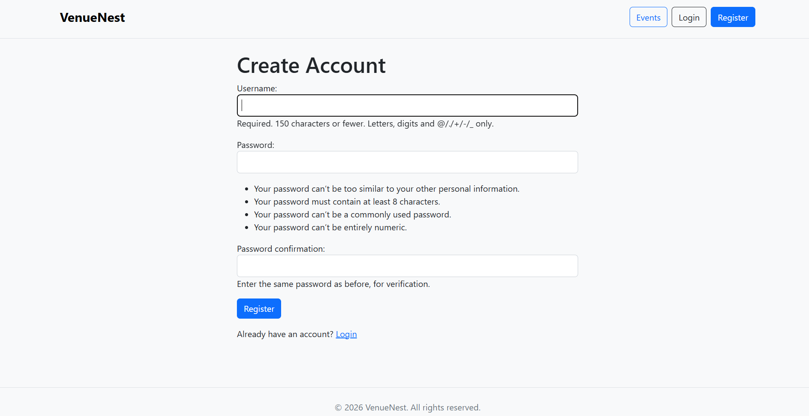
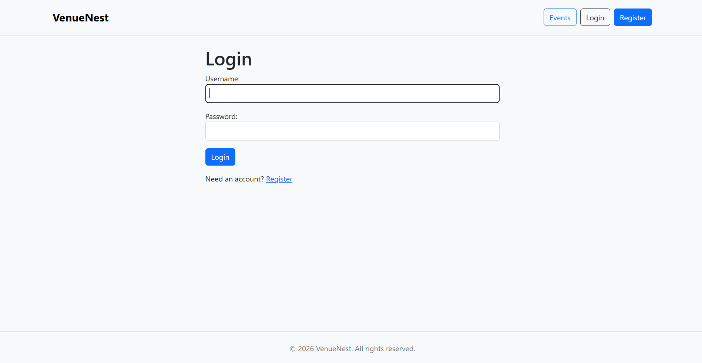
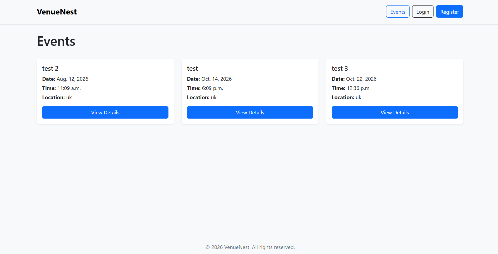
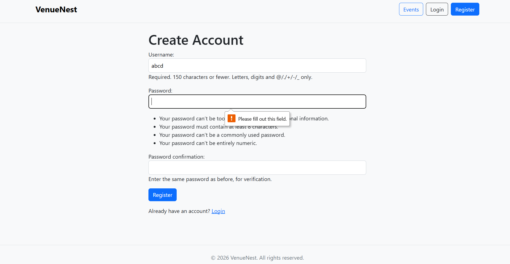
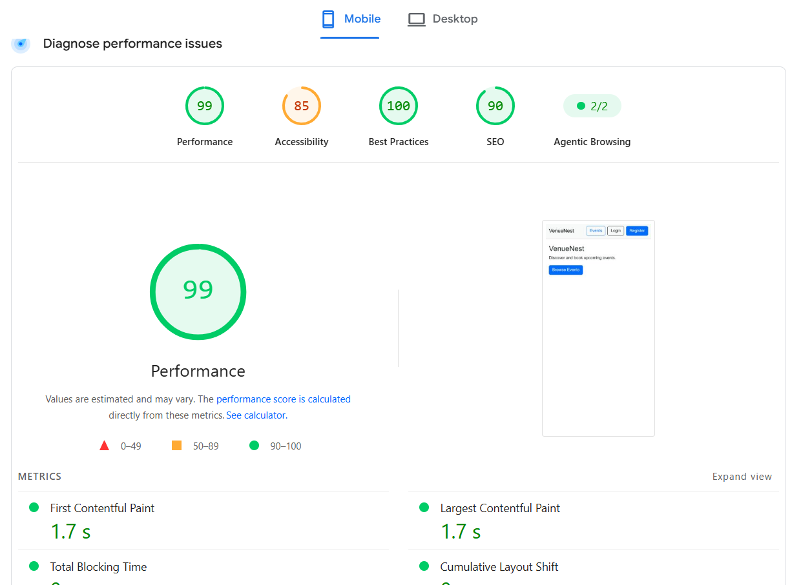
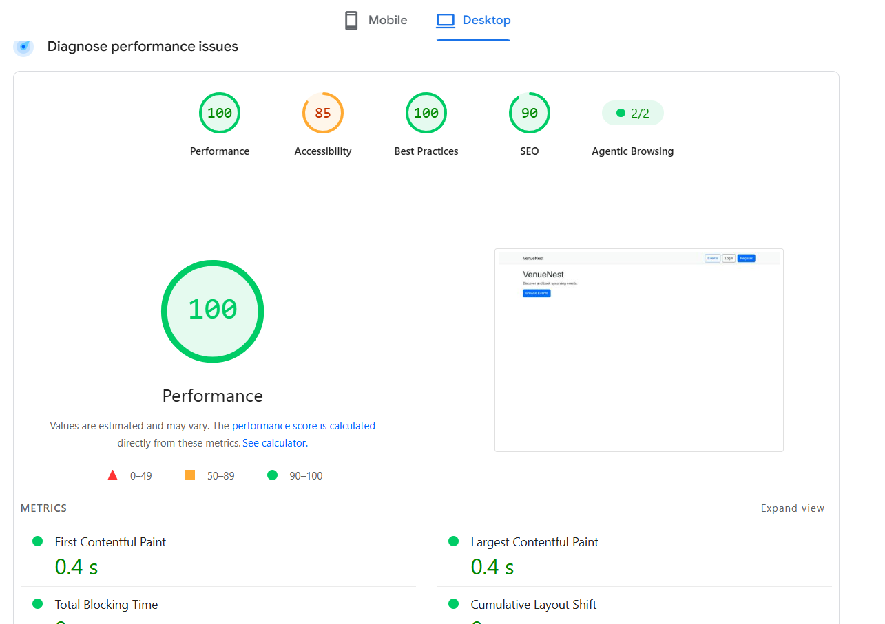

# VenueNest

**Developers:** Rauhan Aziz ([Azizr96](https://github.com/Azizr96)),Shruti Jindal(https://github.com/shrutijind),Davy (https://github.com/davy-berry), Mohammed Chaudhary (https://github.com/nasim-orion/), Marcel Szymczak (https://github.com/xmarcelx2018-cmd)

VenueNest is a responsive event-booking web application built with Django. It allows visitors to browse upcoming events, registered users to make and manage bookings, and staff users to create, edit, and delete events.

The project was developed as a team hackathon using an Agile workflow. The aim was to create a practical MVP that demonstrates full-stack Django development, authentication, database relationships, CRUD functionality, booking validation, responsive design, version control, and cloud deployment.

The idea for VenueNest was chosen because event-booking systems contain several useful real-world development challenges within a manageable project scope. The application needs to support different user roles, protect restricted actions, manage relationships between users and events, prevent invalid bookings, and present information clearly across mobile, tablet, and desktop devices.

The live application is deployed on Heroku.
https://venuenest-c59f0cde663d.herokuapp.com/


---

## UX

### The 5 Planes of UX

#### 1. Strategy

* **Purpose:**
  * Provide visitors with a simple way to discover upcoming events.
  * Allow registered users to book events and manage their own bookings.
  * Give staff users clear tools for managing event information.
  * Prevent common booking problems such as duplicate bookings, overbooking, and booking events that have already passed.

* **Primary User Needs:**
  * Visitors need to browse events without being required to register first.
  * Registered users need an easy registration and login process.
  * Registered users need a clear way to book an event and see their existing bookings.
  * Users need feedback when a booking cannot be made.
  * Staff users need protected controls for creating, editing, and deleting events.
  * All users need the interface to work clearly across different screen sizes.

* **Project Goals:**
  * Deliver a clear and usable event-booking MVP.
  * Demonstrate Django authentication, permissions, CRUD, and relational database functionality.
  * Provide defensive booking logic to protect data integrity.
  * Create a responsive interface using Bootstrap and custom CSS.
  * Deploy the finished application to Heroku using PostgreSQL and WhiteNoise.

#### 2. Scope

The project scope was kept deliberately focused so that the core booking journey could be completed within the hackathon timeframe.

* **Must-have functionality:**
  * User registration, login, and logout.
  * Browse upcoming events and view individual details.
  * Staff-only event creation, editing, and deletion.
  * Authenticated event booking and cancellation.
  * "My Bookings" management page.
  * Duplicate-booking, capacity/sold-out, and past-event protection.
  * Responsive Bootstrap interface.
  * PostgreSQL database and Heroku deployment.

* **Future / Extended functionality:**
  * Event search and category filtering.
  * Staff attendee lists.
  * Event images.
  * Additional event discovery and management features.

#### 3. Structure

* **Information Architecture:**
  * **Home:** Introduction to VenueNest.
  * **Events:** Displays available events.
  * **Event Detail:** Provides full information and booking actions.
  * **Register / Login:** Available to unauthenticated visitors.
  * **My Bookings:** Available to authenticated users.
  * **Create Event:** Visible only to staff users.
  * **Logout:** Available to authenticated users.

* **Primary User Flows:**
  1. Visitor opens VenueNest → browses events → views an event.
  2. Visitor registers → becomes authenticated → books an event.
  3. Registered user opens My Bookings → reviews booked events → cancels a booking if required.
  4. Staff user logs in → creates, edits, or deletes an event.

#### 4. Skeleton

The interface was designed around a simple page hierarchy and reusable Bootstrap components.

##### Wireframes
Wireframes are stored in the assets folder.


| **Home** |
  | 
 
  | 
 
  |

| **Register** |
  |
 
| **Login** | 
 

#### 5. Surface

* **Styling & Presentation:** Bootstrap for layout, cards, navigation, forms, and buttons with custom CSS for project-specific styling.
* **Typography:** Default system font stack via Bootstrap for readability and fast load times across operating systems.

---

## User Stories

| ID | Target | Expectation | Outcome |
| --- | --- | --- | --- |
| **US-01** | As a visitor | I want to create an account | so that I can book events. |
| **US-02** | As a registered user | I want to log in | so that I can access booking features. |
| **US-03** | As an authenticated user | I want to log out | so that I can securely end my session. |
| **US-04** | As a visitor | I want to view available events | so that I can see what is coming up. |
| **US-05** | As a visitor | I want to view event details | so that I can decide whether I want to attend. |
| **US-06** | As a staff user | I want to create events | so that new events can be advertised. |
| **US-07** | As a staff user | I want to edit events | so that event information remains accurate. |
| **US-08** | As a staff user | I want to delete events | so that cancelled or unwanted events can be removed. |
| **US-09** | As a registered user | I want to book an event | so that I can reserve a place. |
| **US-10** | As a registered user | I want to view my bookings | so that I can keep track of events I plan to attend. |
| **US-11** | As a registered user | I want to cancel my booking | so that my place can be released if I can no longer attend. |
| **US-12** | As a user | I want to search events | so that I can find relevant events more quickly. |
| **US-13** | As a user | I want to filter events by category | so that I can browse the type of event I am interested in. |
| **US-14** | As a staff user | I want to view event attendees | so that I can see booking numbers and remaining capacity. |
| **US-15** | As a visitor | I want to see event images | so that event listings are more visually engaging. |

---

## Features

### Existing Features

| Feature | Description | Screenshot |
| --- | --- | --- |
| **Registration** | Visitors can create a Django user account. |  |

| **Login** | Registered users can authenticate securely. |  |

| **Events List** | Visitors can browse available events. |  |
|

---

## Tools & Technologies

| Tool / Technology | Use |
| --- | --- |
| **Python** | Back-end programming language |
| **Django** | Web framework |
| **HTML5 & CSS3** | Page structure and custom styling |
| **JavaScript** | Client-side functionality |
| **Bootstrap** | Responsive UI components |
| **PostgreSQL** | Production relational database |
| **WhiteNoise** | Static-file serving in production |
| **Gunicorn** | Production WSGI HTTP server |
| **Heroku** | Cloud hosting platform |
| **Git & GitHub** | Version control & repository hosting |
| **GitHub Projects** | Agile/Kanban tracking |

---

## Database Design

### Data Model

VenueNest uses Django's built-in `User` model together with the custom `Event` and `Booking` models.

<p align="center">
  
</p>
# Testing

> [!NOTE] 
> Return to the [README.md](README.md) file.

VenueNest was tested using a focused combination of manual functional testing and external validation tools. The testing approach for this project consists of:

* Manual testing
* Lighthouse testing
* HTML validation
* Python CI validation
* CSS validation
* JavaScript validation

> *Note: No automated unit-testing section is included in this project.*

---

## Manual Testing

Manual testing was carried out against the deployed application to confirm that the main user journeys, permissions, and defensive booking rules work as intended.


### Authentication and Navigation


| **Register with valid details** | A new account is created and the user becomes authenticated. | Submit the registration form with valid unique credentials.| 


| **Register with invalid/duplicate details** | Invalid data is rejected and validation feedback is shown. | Submit invalid or duplicate registration details. 


  |


| **Login with valid credentials** | User is logged in and redirected successfully. | Submit the login form with a valid account. 


 [Login](assets/loginvalid.png)


## Responsive Manual Checks

Responsive behaviour is checked manually using browser developer tools.

| Area | Mobile (~375px) | Tablet (~768px) | Desktop (1200px+) |
| --- | --- | --- | --- | --- |
| **Navigation** | Check menu To be completed |
| **Home page** | Check layout and CTA | Check spacing/cards | Check full layout | 
| **Event list** | Cards stack correctly | Cards resize correctly | Multi-column layout | 
| **Forms** | Inputs fit viewport | Forms remain readable | Forms remain centred/readable | 
| **Event detail** | No overflow | Content remains clear | Content uses available space | 
| **My Bookings** | Cards/actions remain usable | Layout remains clear | Layout remains clear 

---

## Lighthouse

Chrome Lighthouse is used against the deployed Heroku application rather than the local development server.

The audit checks:
* Performance
* Accessibility
* Best Practices
* SEO

Run Lighthouse for both mobile and desktop on key public pages:

  |  | 

---

## HTML Validation

The W3C Markup Validation Service is used to validate the final rendered HTML. Because Django templates contain template syntax such as `` and `{{ variable }}`, raw template files should not be pasted directly into the validator.

* **For public pages:** Use the deployed Heroku URL and validate by URI.
* **For authenticated pages:** Open the deployed page while logged in, select **View Page Source**, copy the rendered HTML, and validate using direct input.

| Page / Template | Validation Method | Screenshot | 
| --- | --- | --- | --- |
| **Home** | Live deployed URL |  | 
| **Events** | Live deployed URL | 

---

## CSS Validation

The project's custom CSS is validated using the W3C CSS Validation Service. Third-party Bootstrap CSS is not part of the team's custom code and does not need to be validated as project-authored CSS.


---

## PEP8

|admin.py|


|forms.py|


|models.py|


|urls.py|


# Deployment & Local Development

The live application is deployed on **Heroku**.

---

## Heroku Deployment

The project uses Heroku for cloud deployment, PostgreSQL for the production database, Gunicorn as the production web server, and WhiteNoise for static files.

### Main Deployment Steps

1. **Create Heroku App:** Create a new application in the Heroku Dashboard.
2. **Configure Config Vars:** Set up environment variables under the *Settings* tab:
   * `DATABASE_URL`: PostgreSQL connection string
   * `SECRET_KEY`: Django secret key
   * `DEBUG`: `False`
3. **Dependencies:** Add deployment dependencies (`gunicorn`, `psycopg2-binary`, `whitenoise`) to `requirements.txt`.
4. **Procfile:** Add a file named `Procfile` in the root directory:
   ```txt
   web: gunicorn venuenest.wsgi


 

### Content
* **Django Documentation:** Referenced for framework architecture, URL routing, models, and view guidance.
* **Bootstrap Documentation:** Used for responsive layout structure, navigation bars, cards, and UI components.
* **Heroku Documentation:** Referenced for web application deployment and environment variable configurations.
* **WhiteNoise Documentation:** Used for serving static files efficiently in production.
* **Code Institute:** Course material, project criteria, and documentation guidance informed the structural setup.
* **ChatGPT:** Utilized to support real-time debugging, architectural planning, code optimization, and documentation design.

### Media
* All project screenshots, wireframes, validation results, and Chrome Lighthouse reports are stored inside the root-level `assets/` and `documentation/` directories to separate development assets from Django static files.


### Acknowledgements
Special thanks to the full **VenueNest** hackathon team for collaborating on project development, Git/GitHub feature-branch workflows, comprehensive testing, and full integration throughout the project.Code Institute Team for all guidance and support.
